One factor, two levels
======================

    # simulate data
    dds <- makeExampleDESeqDataSet(n = 1000, m = 6, betaSD = 2)
    dds$condition <- factor(rep(c("shade", "sun"), each = 3))

First we can look at our sample information:

    colData(dds)

    ## DataFrame with 6 rows and 1 column
    ##         condition
    ##          <factor>
    ## sample1     shade
    ## sample2     shade
    ## sample3     shade
    ## sample4     sun  
    ## sample5     sun  
    ## sample6     sun

We define our design and run DESeq model fitting:

    design(dds) <- ~ 1 + condition # or just `~ condition`
    dds <- DESeq(dds) # equivalent to edgeR::glmFit()

    ## estimating size factors

    ## estimating dispersions

    ## gene-wise dispersion estimates

    ## mean-dispersion relationship

    ## final dispersion estimates

    ## fitting model and testing

Then check what coefficients DESeq estimated:

    resultsNames(dds)

    ## [1] "Intercept"              "condition_sun_vs_shade"

We can see that we have a coefficient for our *intercept* and
coefficient for the effect of “sun” (i.e. differences between sun versus
shade).

We can then obtain the results for the effect of sun:

    res1 <- results(dds, contrast = list("condition_sun_vs_shade"))
    res1

    ## log2 fold change (MLE): condition_sun_vs_shade effect 
    ## Wald test p-value: condition_sun_vs_shade effect 
    ## DataFrame with 1000 rows and 6 columns
    ##           baseMean log2FoldChange     lfcSE      stat      pvalue       padj
    ##          <numeric>      <numeric> <numeric> <numeric>   <numeric>  <numeric>
    ## gene1     29.02282      3.1546346  0.859398  3.670751 0.000241839 0.00125783
    ## gene2     29.58346      1.9194327  0.689539  2.783646 0.005375161 0.01774566
    ## gene3      4.13383     -3.6811860  1.714557 -2.147019 0.031791776 0.07455452
    ## gene4    152.41603     -0.6757401  0.380571 -1.775597 0.075799334 0.15078885
    ## gene5     20.27680      0.0799093  0.772992  0.103377 0.917664039 0.93678204
    ## ...            ...            ...       ...       ...         ...        ...
    ## gene996    5.85167       0.357406   1.35407  0.263949   0.7918196  0.8428722
    ## gene997    6.44729      -0.212331   1.14858 -0.184864   0.8533357  0.8946572
    ## gene998    7.07135      -2.797845   1.22080 -2.291816   0.0219163  0.0545563
    ## gene999    3.24602       3.969345   2.47222  1.605577   0.1083669  0.1978227
    ## gene1000   1.57966      -2.108792   2.52256 -0.835972   0.4031705  0.5424158

The above is a simple way to obtain the results of interest. But it is
worth understanding how DESeq is getting to these results by looking at
the model’s matrix. DESeq uses standard R way to define the model
matrix:

    model.matrix(design(dds), colData(dds))

    ##         (Intercept) conditionsun
    ## sample1           1            0
    ## sample2           1            0
    ## sample3           1            0
    ## sample4           1            1
    ## sample5           1            1
    ## sample6           1            1
    ## attr(,"assign")
    ## [1] 0 1
    ## attr(,"contrasts")
    ## attr(,"contrasts")$condition
    ## [1] "contr.treatment"

We can see that R coded “condition” as s dummy variable, with an
intercept (common to all samples) and a “conditionsun” variable, which
adds the effect of sun to samples 4-6.

We can actually set our contrasts in `DESeq2::results()` using a numeric
vector. The way it works is to define a vector of “weights” for the
coefficient(s) we want to test for. In this case, we have `(Intercept)`
and `conditionsun` as our coefficients (see model matrix above), and we
want to test for the effect of sun, so our contrast vector would be
`c(0, 1)`.

In this case the design is very simple, but it can get difficult in more
complex designs. So, it’s worth mentioning the general way in which we
can define this:

    # get the model matrix
    mod_mat <- model.matrix(design(dds), colData(dds))
    mod_mat

    ##         (Intercept) conditionsun
    ## sample1           1            0
    ## sample2           1            0
    ## sample3           1            0
    ## sample4           1            1
    ## sample5           1            1
    ## sample6           1            1
    ## attr(,"assign")
    ## [1] 0 1
    ## attr(,"contrasts")
    ## attr(,"contrasts")$condition
    ## [1] "contr.treatment"

    # calculate weights for coefficients in each condition
    sun <- colMeans(mod_mat[dds$condition == "sun", ])
    sun

    ##  (Intercept) conditionsun 
    ##            1            1

    shade <- colMeans(mod_mat[dds$condition == "shade", ])
    shade

    ##  (Intercept) conditionsun 
    ##            1            0

    # our contrast is
    sun - shade

    ##  (Intercept) conditionsun 
    ##            0            1

    # get the results for this contrast
    res2 <- results(dds, contrast = sun - shade)

And we can check that the results are the same:

    plot(res1$log2FoldChange, res2$log2FoldChange)

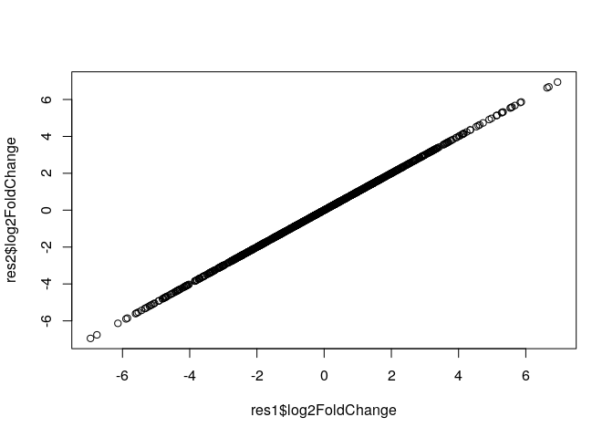

Recoding the design - no intercept
----------------------------------

Often, we can use different model matrices that essentially correspond
to the same design. For example, we could recode our design above by
removing the intercept:

    design(dds) <- ~ 0 + condition
    dds <- DESeq(dds)

    ## using pre-existing size factors

    ## estimating dispersions

    ## found already estimated dispersions, replacing these

    ## gene-wise dispersion estimates

    ## mean-dispersion relationship

    ## final dispersion estimates

    ## fitting model and testing

    resultsNames(dds)

    ## [1] "conditionshade" "conditionsun"

In this case we get a coefficient corresponding to the average
expression in shade and the average expression in the sun (rather than
the *difference* between sun and shade).

If we use the same contrast trick as before (using the model matrix), we
can see the result is the same:

    # get the model matrix
    mod_mat <- model.matrix(design(dds), colData(dds))
    mod_mat

    ##         conditionshade conditionsun
    ## sample1              1            0
    ## sample2              1            0
    ## sample3              1            0
    ## sample4              0            1
    ## sample5              0            1
    ## sample6              0            1
    ## attr(,"assign")
    ## [1] 1 1
    ## attr(,"contrasts")
    ## attr(,"contrasts")$condition
    ## [1] "contr.treatment"

    # calculate weights for coefficients in each condition
    sun <- colMeans(mod_mat[which(dds$condition == "sun"), ])
    sun

    ## conditionshade   conditionsun 
    ##              0              1

    shade <- colMeans(mod_mat[which(dds$condition == "shade"), ])
    shade

    ## conditionshade   conditionsun 
    ##              1              0

    # our contrast is
    sun - shade

    ## conditionshade   conditionsun 
    ##             -1              1

    res3 <- results(dds, contrast = sun - shade)

Again, the results are essentially the same:

    plot(res1$log2FoldChange, res3$log2FoldChange)

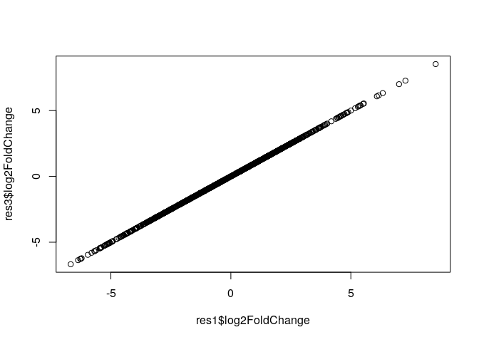

In theory there’s no difference between these two ways of defining our
design. The design with an intercept is more common, but for the
purposes of understanding what’s going on, it’s sometimes easier to look
at models without intercept.

One factor, three levels
========================

    # simulate data
    dds <- makeExampleDESeqDataSet(n = 1000, m = 9, betaSD = 2)
    dds$condition <- NULL
    dds$colour <- factor(rep(c("pink", "yellow", "white"), each = 3))
    dds$colour <- relevel(dds$colour, "white")
    colData(dds)

    ## DataFrame with 9 rows and 1 column
    ##           colour
    ##         <factor>
    ## sample1   pink  
    ## sample2   pink  
    ## sample3   pink  
    ## sample4   yellow
    ## sample5   yellow
    ## sample6   yellow
    ## sample7   white 
    ## sample8   white 
    ## sample9   white

We define our design and fit the model:

    design(dds) <- ~ 1 + colour
    dds <- DESeq(dds)

    ## estimating size factors

    ## estimating dispersions

    ## gene-wise dispersion estimates

    ## mean-dispersion relationship

    ## final dispersion estimates

    ## fitting model and testing

    resultsNames(dds)

    ## [1] "Intercept"              "colour_pink_vs_white"   "colour_yellow_vs_white"

We see that now we have 3 coefficients:

-   “Intercept” corresponds to white colour (our reference level)
-   “colour\_pink\_vs\_white” corresponds to the difference between the
    reference level and pink
-   “colour\_yellow\_vs\_white” corresponds to the difference between
    the reference level and yellow

We could obtain the difference between white and any of the two colours
easily:

    res1_pink_white <- results(dds, contrast = list("colour_pink_vs_white"))
    res1_yellow_white <- results(dds, contrast = list("colour_yellow_vs_white"))

    res1_pink_yellow <- results(dds, contrast = list("colour_pink_vs_white", 
                                                     "colour_yellow_vs_white"))

Again, we can define comparisons from the design matrix:

    mod_mat <- model.matrix(design(dds), colData(dds))
    mod_mat

    ##         (Intercept) colourpink colouryellow
    ## sample1           1          1            0
    ## sample2           1          1            0
    ## sample3           1          1            0
    ## sample4           1          0            1
    ## sample5           1          0            1
    ## sample6           1          0            1
    ## sample7           1          0            0
    ## sample8           1          0            0
    ## sample9           1          0            0
    ## attr(,"assign")
    ## [1] 0 1 1
    ## attr(,"contrasts")
    ## attr(,"contrasts")$colour
    ## [1] "contr.treatment"

    # calculate weights for coefficients in each group
    pink <- colMeans(mod_mat[dds$colour == "pink", ])
    pink

    ##  (Intercept)   colourpink colouryellow 
    ##            1            1            0

    white <- colMeans(mod_mat[dds$colour == "white", ])
    white

    ##  (Intercept)   colourpink colouryellow 
    ##            1            0            0

    yellow <- colMeans(mod_mat[dds$colour == "yellow", ])
    yellow

    ##  (Intercept)   colourpink colouryellow 
    ##            1            0            1

And we can now define any contrasts we want:

    res2_pink_white <- results(dds, contrast = pink - white)
    res2_pink_yellow <- results(dds, contrast = pink - yellow)

    # check they are identical
    plot(res1_pink_white$log2FoldChange, res2_pink_white$log2FoldChange)

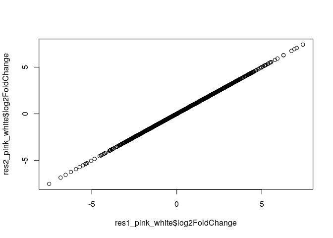

    plot(res1_pink_yellow$log2FoldChange, res2_pink_yellow$log2FoldChange)

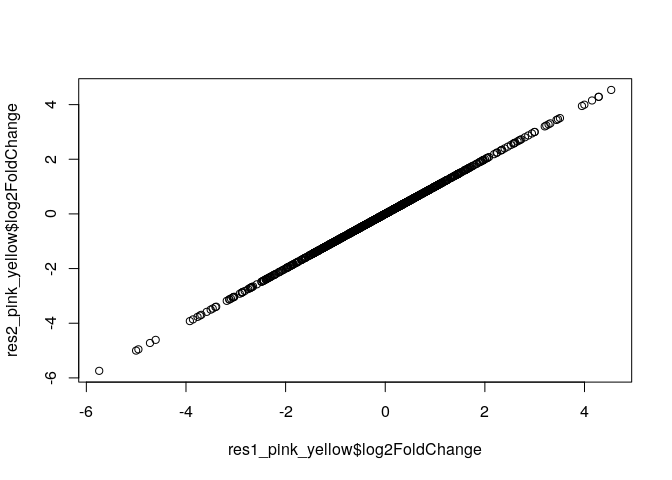

We could even say that we want to find genes that generally differ
between pigmented and non-pigmented samples:

    # define vector of means for pigmented samples
    pigmented <- colMeans(mod_mat[dds$colour %in% c("pink", "yellow"),])
    pigmented

    ##  (Intercept)   colourpink colouryellow 
    ##          1.0          0.5          0.5

    # this is our contrast now
    pigmented - white

    ##  (Intercept)   colourpink colouryellow 
    ##          0.0          0.5          0.5

    # get the results
    res2_pigmented <- results(dds, contrast = pigmented - white)

    # could have also set the contrast like this
    (pink + yellow)/2 - white # average of pink and yellow minus white

    ##  (Intercept)   colourpink colouryellow 
    ##          0.0          0.5          0.5

We could have created a mock group in our column data:

    dds$pigmented <- factor(dds$colour %in% c("pink", "yellow"))
    colData(dds)

    ## DataFrame with 9 rows and 3 columns
    ##           colour sizeFactor pigmented
    ##         <factor>  <numeric>  <factor>
    ## sample1   pink     0.950750     TRUE 
    ## sample2   pink     0.981239     TRUE 
    ## sample3   pink     0.903718     TRUE 
    ## sample4   yellow   0.976772     TRUE 
    ## sample5   yellow   0.914177     TRUE 
    ## sample6   yellow   1.178293     TRUE 
    ## sample7   white    1.161341     FALSE
    ## sample8   white    1.090987     FALSE
    ## sample9   white    1.118380     FALSE

and then re-run DESeq with a new design:

    design(dds) <- ~ 1 + pigmented
    dds <- DESeq(dds)

    ## using pre-existing size factors

    ## estimating dispersions

    ## found already estimated dispersions, replacing these

    ## gene-wise dispersion estimates

    ## mean-dispersion relationship

    ## final dispersion estimates

    ## fitting model and testing

    resultsNames(dds)

    ## [1] "Intercept"               "pigmented_TRUE_vs_FALSE"

    res1_pigmented <- results(dds, contrast = list("pigmented_TRUE_vs_FALSE"))

However, in this model the gene dispersion is estimated together for
pink and yellow samples, which may result in inflated estimates.
Instead, our approach above correctly estimates the error within each of
those groups.

    plot(res1_pigmented$log2FoldChange, res2_pigmented$log2FoldChange); abline(0, 1, col = "brown")

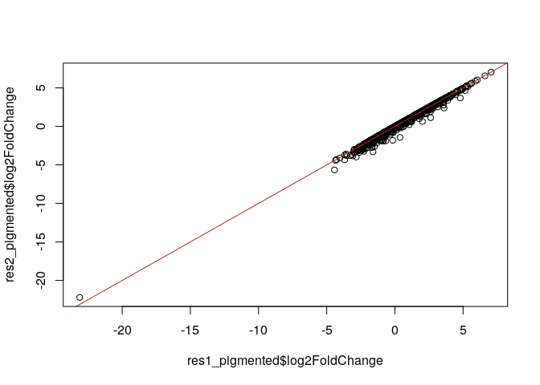

    plot(res1_pigmented$lfcSE, res2_pigmented$lfcSE); abline(0, 1, col = "brown")

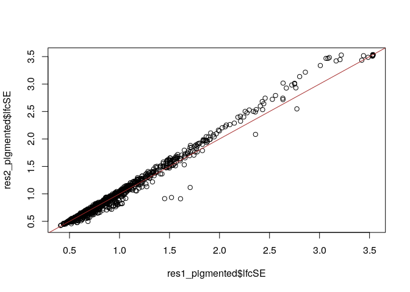

Two factors with interaction
============================

    # simulate data
    dds <- makeExampleDESeqDataSet(n = 1000, m = 12, betaSD = 2)
    dds$colour <- factor(rep(c("pink", "white"), each = 6))
    dds$colour <- relevel(dds$colour, "white")
    dds$condition <- factor(rep(c("sun", "shade"), 6))
    dds <- dds[, order(dds$colour, dds$condition)]
    colnames(dds) <- paste0("sample", 1:ncol(dds))

Define our design and run the model:

    design(dds) <- ~ 1 + colour + condition + colour:condition
    dds <- DESeq(dds)

    ## estimating size factors

    ## estimating dispersions

    ## gene-wise dispersion estimates

    ## mean-dispersion relationship

    ## final dispersion estimates

    ## fitting model and testing

    resultsNames(dds)

    ## [1] "Intercept"               "colour_pink_vs_white"   
    ## [3] "condition_sun_vs_shade"  "colourpink.conditionsun"

Now we have an interaction, so we need to think about what it is we want
to test for. Let’s see how to do this with the model matrix (basically
all the same we’ve been doing so far), and show the equivalent syntax
using the coefficient names.

    mod_mat <- model.matrix(design(dds), colData(dds))
    mod_mat

    ##          (Intercept) colourpink conditionsun colourpink:conditionsun
    ## sample1            1          0            0                       0
    ## sample2            1          0            0                       0
    ## sample3            1          0            0                       0
    ## sample4            1          0            1                       0
    ## sample5            1          0            1                       0
    ## sample6            1          0            1                       0
    ## sample7            1          1            0                       0
    ## sample8            1          1            0                       0
    ## sample9            1          1            0                       0
    ## sample10           1          1            1                       1
    ## sample11           1          1            1                       1
    ## sample12           1          1            1                       1
    ## attr(,"assign")
    ## [1] 0 1 2 3
    ## attr(,"contrasts")
    ## attr(,"contrasts")$colour
    ## [1] "contr.treatment"
    ## 
    ## attr(,"contrasts")$condition
    ## [1] "contr.treatment"

    # Define vectors for each condition
    pink_shade <- colMeans(mod_mat[dds$colour == "pink" & dds$condition == "shade", ])
    pink_sun <- colMeans(mod_mat[dds$colour == "pink" & dds$condition == "sun", ])
    white_shade <- colMeans(mod_mat[dds$colour == "white" & dds$condition == "shade", ])
    white_sun <- colMeans(mod_mat[dds$colour == "white" & dds$condition == "sun", ])

Pink vs White (in the shade):

    res1 <- results(dds, contrast = pink_shade - white_shade)
    res2 <- results(dds, contrast = list("colour_pink_vs_white"))
    plot(res1$log2FoldChange, res2$log2FoldChange)

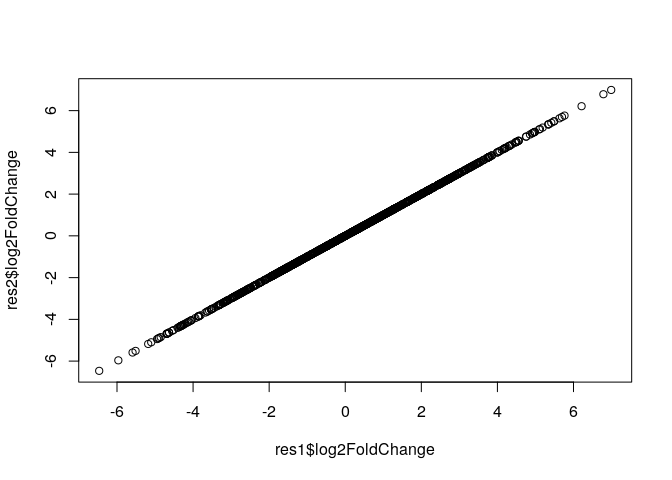

Pink vs White (in the sun):

    res1 <- results(dds, contrast = pink_sun - white_sun)
    res2 <- results(dds, contrast = list(c("colour_pink_vs_white",
                                           "colourpink.conditionsun")))
    plot(res1$log2FoldChange, res2$log2FoldChange)

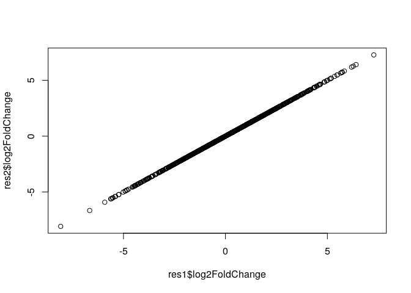

Sun vs Shade (for whites):

    res1 <- results(dds, contrast = white_sun - white_shade)
    res2 <- results(dds, contrast = list(c("condition_sun_vs_shade")))
    plot(res1$log2FoldChange, res2$log2FoldChange)

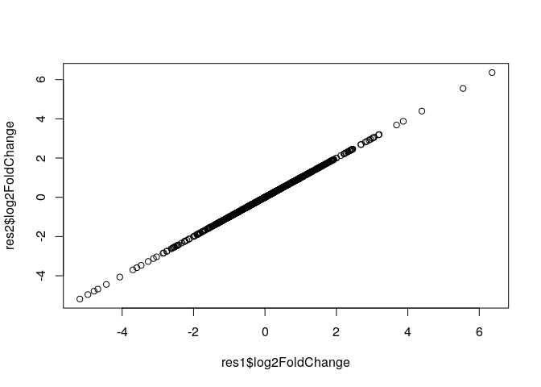

Sun vs Shade (for pinks):

    res1 <- results(dds, contrast = pink_sun - pink_shade)
    res2 <- results(dds, contrast = list(c("condition_sun_vs_shade", "colourpink.conditionsun")))
    plot(res1$log2FoldChange, res2$log2FoldChange)

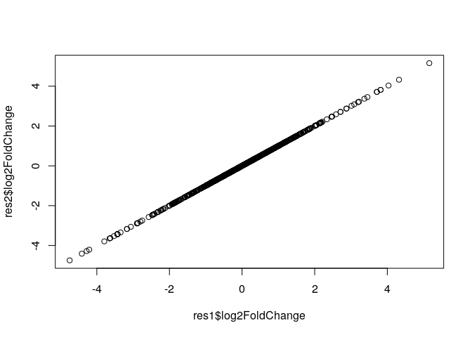

Interaction between colour and condition (i.e. do pinks and whites
respond differently to the sun?):

    res1 <- results(dds, 
                    contrast = (pink_sun - pink_shade) - (white_sun - white_shade))
    res2 <- results(dds, contrast = list("colourpink.conditionsun"))
    plot(res1$log2FoldChange, res2$log2FoldChange)

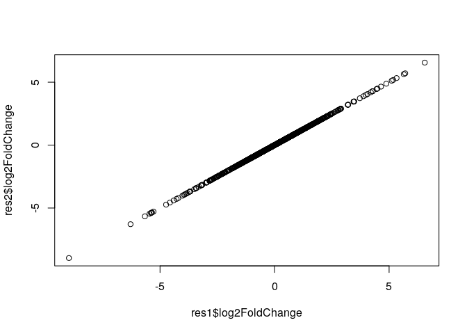

In conclusion, although we can define these contrasts using DESeq
coefficient names, it is somewhat more explicit (and perhaps intuitive?)
what it is we’re comparing using matrix-based contrasts.

Three factors, with nesting
===========================

    # simulate data
    dds <- makeExampleDESeqDataSet(n = 1000, m = 24, betaSD = 2)
    dds$colour <- factor(rep(c("white", "pink"), each = 12))
    dds$colour <- relevel(dds$colour, "white")
    dds$species <- factor(rep(LETTERS[1:4], each = 6))
    dds$condition <- factor(rep(c("sun", "shade"), 12))
    dds <- dds[, order(dds$colour, dds$species, dds$condition)]
    colnames(dds) <- paste0("sample", 1:ncol(dds))

Here, we define our design without including “colour”. This is because
colour is a linear combination with species (or, another way to think
about it is that colour is redundant with species). So, we use “species”
instead of colour, but later compare groups of species of the same
colour with each other.

    design(dds) <- ~ 1 + species + condition + species:condition
    dds <- DESeq(dds)

    ## estimating size factors

    ## estimating dispersions

    ## gene-wise dispersion estimates

    ## mean-dispersion relationship

    ## final dispersion estimates

    ## fitting model and testing

    resultsNames(dds)

    ## [1] "Intercept"              "species_B_vs_A"         "species_C_vs_A"        
    ## [4] "species_D_vs_A"         "condition_sun_vs_shade" "speciesB.conditionsun" 
    ## [7] "speciesC.conditionsun"  "speciesD.conditionsun"

Now it’s harder to define contrasts between groups of species of the
same colour using DESeq’s coefficient names (although still possible).
But using the model matrix approach, we do it in exactly the same way we
have done so far!

Again, let’s define our groups from the model matrix:

    mod_mat <- model.matrix(design(dds), colData(dds))
    mod_mat

    ##          (Intercept) speciesB speciesC speciesD conditionsun
    ## sample1            1        0        0        0            0
    ## sample2            1        0        0        0            0
    ## sample3            1        0        0        0            0
    ## sample4            1        0        0        0            1
    ## sample5            1        0        0        0            1
    ## sample6            1        0        0        0            1
    ## sample7            1        1        0        0            0
    ## sample8            1        1        0        0            0
    ## sample9            1        1        0        0            0
    ## sample10           1        1        0        0            1
    ## sample11           1        1        0        0            1
    ## sample12           1        1        0        0            1
    ## sample13           1        0        1        0            0
    ## sample14           1        0        1        0            0
    ## sample15           1        0        1        0            0
    ## sample16           1        0        1        0            1
    ## sample17           1        0        1        0            1
    ## sample18           1        0        1        0            1
    ## sample19           1        0        0        1            0
    ## sample20           1        0        0        1            0
    ## sample21           1        0        0        1            0
    ## sample22           1        0        0        1            1
    ## sample23           1        0        0        1            1
    ## sample24           1        0        0        1            1
    ##          speciesB:conditionsun speciesC:conditionsun speciesD:conditionsun
    ## sample1                      0                     0                     0
    ## sample2                      0                     0                     0
    ## sample3                      0                     0                     0
    ## sample4                      0                     0                     0
    ## sample5                      0                     0                     0
    ## sample6                      0                     0                     0
    ## sample7                      0                     0                     0
    ## sample8                      0                     0                     0
    ## sample9                      0                     0                     0
    ## sample10                     1                     0                     0
    ## sample11                     1                     0                     0
    ## sample12                     1                     0                     0
    ## sample13                     0                     0                     0
    ## sample14                     0                     0                     0
    ## sample15                     0                     0                     0
    ## sample16                     0                     1                     0
    ## sample17                     0                     1                     0
    ## sample18                     0                     1                     0
    ## sample19                     0                     0                     0
    ## sample20                     0                     0                     0
    ## sample21                     0                     0                     0
    ## sample22                     0                     0                     1
    ## sample23                     0                     0                     1
    ## sample24                     0                     0                     1
    ## attr(,"assign")
    ## [1] 0 1 1 1 2 3 3 3
    ## attr(,"contrasts")
    ## attr(,"contrasts")$species
    ## [1] "contr.treatment"
    ## 
    ## attr(,"contrasts")$condition
    ## [1] "contr.treatment"

    # define coefficient vectors for each group
    pink_shade <- colMeans(mod_mat[dds$colour == "pink" & dds$condition == "shade", ])
    white_shade <- colMeans(mod_mat[dds$colour == "white" & dds$condition == "shade", ])
    pink_sun <- colMeans(mod_mat[dds$colour == "pink" & dds$condition == "sun", ])
    white_sun <- colMeans(mod_mat[dds$colour == "white" & dds$condition == "sun", ])

Now, it’s worth looking at each of these vectors, to see that they are
composed of a mixture of coefficients from different species:

    pink_shade

    ##           (Intercept)              speciesB              speciesC 
    ##                   1.0                   0.0                   0.5 
    ##              speciesD          conditionsun speciesB:conditionsun 
    ##                   0.5                   0.0                   0.0 
    ## speciesC:conditionsun speciesD:conditionsun 
    ##                   0.0                   0.0

    white_shade

    ##           (Intercept)              speciesB              speciesC 
    ##                   1.0                   0.5                   0.0 
    ##              speciesD          conditionsun speciesB:conditionsun 
    ##                   0.0                   0.0                   0.0 
    ## speciesC:conditionsun speciesD:conditionsun 
    ##                   0.0                   0.0

These coefficients are weighted so that, for example, for “white”
species, we have equal contribution from “speciesC” and “speciesD”.

When we define our contrasts, each species will be correctly weighted:

    pink_sun - pink_shade

    ##           (Intercept)              speciesB              speciesC 
    ##                   0.0                   0.0                   0.0 
    ##              speciesD          conditionsun speciesB:conditionsun 
    ##                   0.0                   1.0                   0.0 
    ## speciesC:conditionsun speciesD:conditionsun 
    ##                   0.5                   0.5

We can set our contrasts in exactly the same way as we did in the
previous section.

For completeness, here’s the contrasts using DESeq’s named coefficients:

    res1_pink_white_shade <- results(dds, 
                               contrast = list(c("species_B_vs_A"),
                                               c("species_C_vs_A", "species_D_vs_A")))
    res2_pink_white_shade <- results(dds, contrast = pink_shade - white_shade)

    res1_pink_white_sun <- results(dds, 
                               contrast = list(c("species_B_vs_A",
                                                 "speciesB.conditionsun"),
                                               c("species_C_vs_A", 
                                                 "species_D_vs_A",
                                                 "speciesC.conditionsun",
                                                 "speciesD.conditionsun")))
    res2_pink_white_sun <- results(dds, contrast = pink_sun - white_sun)

    # didn't finish this... too much hassle

Inbalanced design
-----------------

Let’s take our previous example, but drop one of the samples from the
data, so that we only have 2 replicates for it.

    dds <- dds[, -13] # drop one of the species C samples
    dds <- DESeq(dds)

    ## using pre-existing size factors

    ## estimating dispersions

    ## found already estimated dispersions, replacing these

    ## gene-wise dispersion estimates

    ## mean-dispersion relationship

    ## final dispersion estimates

    ## fitting model and testing

    resultsNames(dds)

    ## [1] "Intercept"              "species_B_vs_A"         "species_C_vs_A"        
    ## [4] "species_D_vs_A"         "condition_sun_vs_shade" "speciesB.conditionsun" 
    ## [7] "speciesC.conditionsun"  "speciesD.conditionsun"

Define our model matrix and coefficient vectors:

    mod_mat <- model.matrix(design(dds), colData(dds))
    mod_mat

    ##          (Intercept) speciesB speciesC speciesD conditionsun
    ## sample1            1        0        0        0            0
    ## sample2            1        0        0        0            0
    ## sample3            1        0        0        0            0
    ## sample4            1        0        0        0            1
    ## sample5            1        0        0        0            1
    ## sample6            1        0        0        0            1
    ## sample7            1        1        0        0            0
    ## sample8            1        1        0        0            0
    ## sample9            1        1        0        0            0
    ## sample10           1        1        0        0            1
    ## sample11           1        1        0        0            1
    ## sample12           1        1        0        0            1
    ## sample14           1        0        1        0            0
    ## sample15           1        0        1        0            0
    ## sample16           1        0        1        0            1
    ## sample17           1        0        1        0            1
    ## sample18           1        0        1        0            1
    ## sample19           1        0        0        1            0
    ## sample20           1        0        0        1            0
    ## sample21           1        0        0        1            0
    ## sample22           1        0        0        1            1
    ## sample23           1        0        0        1            1
    ## sample24           1        0        0        1            1
    ##          speciesB:conditionsun speciesC:conditionsun speciesD:conditionsun
    ## sample1                      0                     0                     0
    ## sample2                      0                     0                     0
    ## sample3                      0                     0                     0
    ## sample4                      0                     0                     0
    ## sample5                      0                     0                     0
    ## sample6                      0                     0                     0
    ## sample7                      0                     0                     0
    ## sample8                      0                     0                     0
    ## sample9                      0                     0                     0
    ## sample10                     1                     0                     0
    ## sample11                     1                     0                     0
    ## sample12                     1                     0                     0
    ## sample14                     0                     0                     0
    ## sample15                     0                     0                     0
    ## sample16                     0                     1                     0
    ## sample17                     0                     1                     0
    ## sample18                     0                     1                     0
    ## sample19                     0                     0                     0
    ## sample20                     0                     0                     0
    ## sample21                     0                     0                     0
    ## sample22                     0                     0                     1
    ## sample23                     0                     0                     1
    ## sample24                     0                     0                     1
    ## attr(,"assign")
    ## [1] 0 1 1 1 2 3 3 3
    ## attr(,"contrasts")
    ## attr(,"contrasts")$species
    ## [1] "contr.treatment"
    ## 
    ## attr(,"contrasts")$condition
    ## [1] "contr.treatment"

    # define coefficient vectors for each group
    pink_shade <- colMeans(mod_mat[dds$colour == "pink" & dds$condition == "shade", ])
    white_shade <- colMeans(mod_mat[dds$colour == "white" & dds$condition == "shade", ])
    pink_sun <- colMeans(mod_mat[dds$colour == "pink" & dds$condition == "sun", ])
    white_sun <- colMeans(mod_mat[dds$colour == "white" & dds$condition == "sun", ])

Now let’s check what happens to the pink\_shade group:

    pink_shade

    ##           (Intercept)              speciesB              speciesC 
    ##                   1.0                   0.0                   0.4 
    ##              speciesD          conditionsun speciesB:conditionsun 
    ##                   0.6                   0.0                   0.0 
    ## speciesC:conditionsun speciesD:conditionsun 
    ##                   0.0                   0.0

Notice that whereas before “speciesC” and “speciesD” had each a weight
of 0.5, now they have different weights. That’s because for speciesC
there’s only 2 replicates. So, we have a total of 5 white individuals in
the shade (2 from species C and 3 from D). Therefore, when we calculate
the average coefficients for pinks, we need to do it as 0.4 x speciesC +
0.6 x speciesD.

The nice thing about this approach is that we do not need to worry about
any of this, the weights come from our `colMeans()` call automatically.
And now, any contrasts that we make will take these weights into
account:

    # pink vs white (in the shade)
    pink_shade - white_shade

    ##           (Intercept)              speciesB              speciesC 
    ##                   0.0                  -0.5                   0.4 
    ##              speciesD          conditionsun speciesB:conditionsun 
    ##                   0.6                   0.0                   0.0 
    ## speciesC:conditionsun speciesD:conditionsun 
    ##                   0.0                   0.0

    # interaction
    (pink_sun - pink_shade) - (white_sun - white_shade)

    ##           (Intercept)              speciesB              speciesC 
    ##                   0.0                   0.0                   0.1 
    ##              speciesD          conditionsun speciesB:conditionsun 
    ##                  -0.1                   0.0                  -0.5 
    ## speciesC:conditionsun speciesD:conditionsun 
    ##                   0.5                   0.5

Further reading
===============

-   Nested design:
    <a href="http://seqanswers.com/forums/showthread.php?t=47766" class="uri">http://seqanswers.com/forums/showthread.php?t=47766</a>

(would be good to know if there is a central place with documentation
about this)
